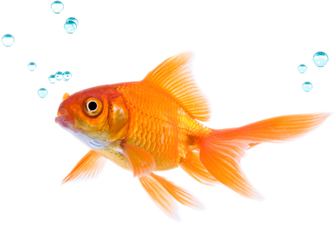

---
title: "lvbr"
author: "Lina"
date: "24 de marzo de 2016"
output: html_document
---

```{r setup, include=FALSE}
knitr::opts_chunk$set(echo = T)
```

# Bien hecho se ve asi

# Encabezado

Texto aqui

## Subtìtulo

Texto aca

### Sub-subtitulo

bla bla bla

#### Sub sub subtitulo.... y asì con cada "#"

yayyyy

# Formatos de texto

Puedes escribir en negritas asi: `**esto en negritas**` y se ve asi: **esto en negritas**

Puedes escribir en italicas asi: `*esto en italicas*` y se ve asi: *esto en italicas*

# Tablas

Hay dos formas de hacer tablas (tres, si incluyes el stargazer que ya conoces).

## Opcion 1, manualmente:

Unicamente las primeras dos filas (de codigo, no de la tabla) deben de estar alineadas. Lo demas es por pura estetica y psicorigidez mia

Columna 1 | *Columna 2* | **Columna 3**
----------|-------------|---------------
a         | b           | c
a         | b           | c
a         | b           | c
a         | b           | c

## Opcion 2, con `knitr::kable()`

kable es una funcion dentro del paquete de knitr. Le das un data frame o una tabla y automaticamente genera el codigo para una tabla. Este lo tienes que usar dentro de un `chunk` de programacion, asi:

```{r}

library(knitr)

# Primero creamos el data frame

A=data.frame(Columna1=c("a","a","a","a","a"),
             Columna2=c("b","b","b","b","b"),
             Columna3=c("c","c","c","c","c"))
# Y luego simplemente uso

kable(A, caption="Caption para tu tabla")
```

Se ven exactamente igual. La ventaja de usar ´knitr::kable()´ es que no tienes que hacerlo manualmente, y puedes reportar datos almacenados en variables (como p valores!). Otra ventaja es que puedes incluir captions automaticamente.

# Listas:

Con asteriscos...

* a
* b
* c
* d

O guiones, se ve igual!

- a
- b
- c
- d

# Ecuaciones

Puden ir en linea con el texto asi `$y=mx+b$` y termina viendose asi: $y=mx+b$

o separadas, mas formalment asi `$$y=mx+b$$` para que se ve asi $$y=mx+b$$ Yo escribi todo en la misma linea en el documento, pero me lo separa automaticamente. El uso de un signo o dos sirve para TODAS las ecuaciones, sin importar lo que tengan adentro.

Puedes usar ecuaciones mas complicadas. Puedes usar fracciones con el codigo `$\frac{numerador}{denominador}$` y entonces se ve asi: $\frac{numerador}{denominador}$

Esto sirve mucho, especialmente para ecuaciones como : $\frac{d}{dx}(X^2+2)=2X$

Puedes usr subindices y superindices con el guion bajo (subindice) y acento de casita (superindice). Si son varios elementos, pondrias algo como `$Y=A^{todo esto como superindice}$` y se veria asi: $Y=A^{todo esto como superindice}$. Nota que en las ecuaciones no hay espacios, asì que todo ese texto es interrumpido.

Hay muchos operadores matematicos utiles, como la sumatoria:

$\frac{\sum_{i=1}^nX_i}{n}$ o $$\frac{\sum_{i=1}^nX_i}{n}$$

Simbolo de mas menos $\pm$

O letras griegas $\alpha, \beta, \gamma, \delta$ y muchas cosas mas...

# Incluyendo programacion

Puedes usar codigo en linea al ponerlo entre comillas. Por ejemplo, 2+2 es `r 2+2`. Ve el codigo en la linea 109 para ver de donde sale el 4. Entre esas comillas tambien puedes llamar variables que ya esten definidas.

Por ejemplo, podemos hacer un modelo lineal con el siguiente codigo. Nota en la lina 113 del codigo que uso tres acentos hacia atras y, entre {} una r. Esto indica que el codigo entre esos acentos hacia atras es de R y deve de ser evaluado por la consola.

```{r}

# hacemos el modelo:

mod1=lm(mpg~cyl, data=mtcars)


```

Como `mod1` tiene los coeficientes, podemos acceder a ellos y reportarlos directamente asi:

El modelo tiene una ordenada al origen con valor de 'r mod1$coefficients[[1]]' y una pendiente de 'r mod1$coefficients[[2]]'.

# Graficas

Puedes usar chuncks de programacion para incluir graficas asi:

```{r, fig.cap="Caption para tu figura, que acepta **negritas** o *italicas*"}

library(ggplot2)

ggplot(mtcars, aes(cyl, mpg, color=hp))+
  geom_point()+
  theme_bw()

```

# Links

Finalmente, puedes incluir links asi:

[Link a google](google.com)

O imagenes asi:

Tu vas a tener que hacer una pagina (llamada index) con lo siguiente:

- Una grafica generada en R
- Incluir una imagen desde internet
- Una tabla generada a mano
- Una tabla generada con `knitr::kable()`
- Un texto donde uses codigo en linea para reportar un resultado
- Una ecuacion en linea
- Una ecuacion separada del texto
- Una lista!

Deberas de tener un encabezado para imagenes, con subtitulos para la grafica de R y la imagen de internet. Un encabezado para las tablas, cada una con un subtitulo. Un encabezado para el texto, y un encabezado para las ecuaciones. Igual, cada tabla con un subtitulo. Lo mismo para las listas.

